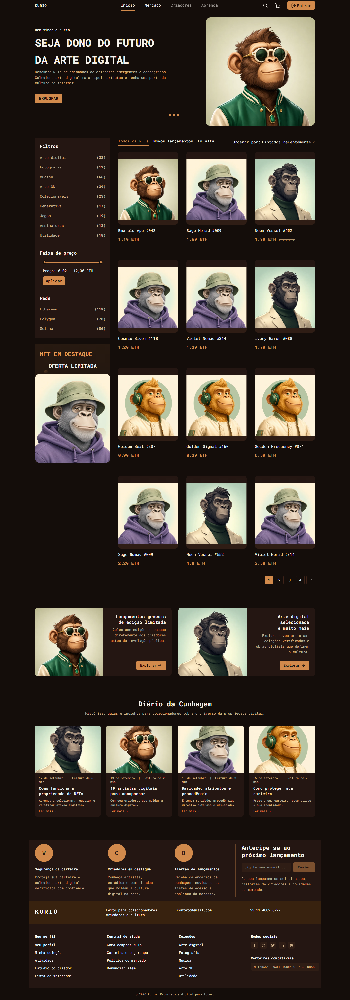
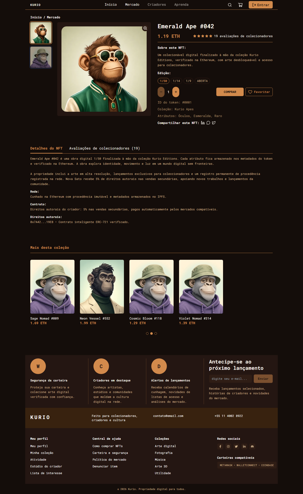
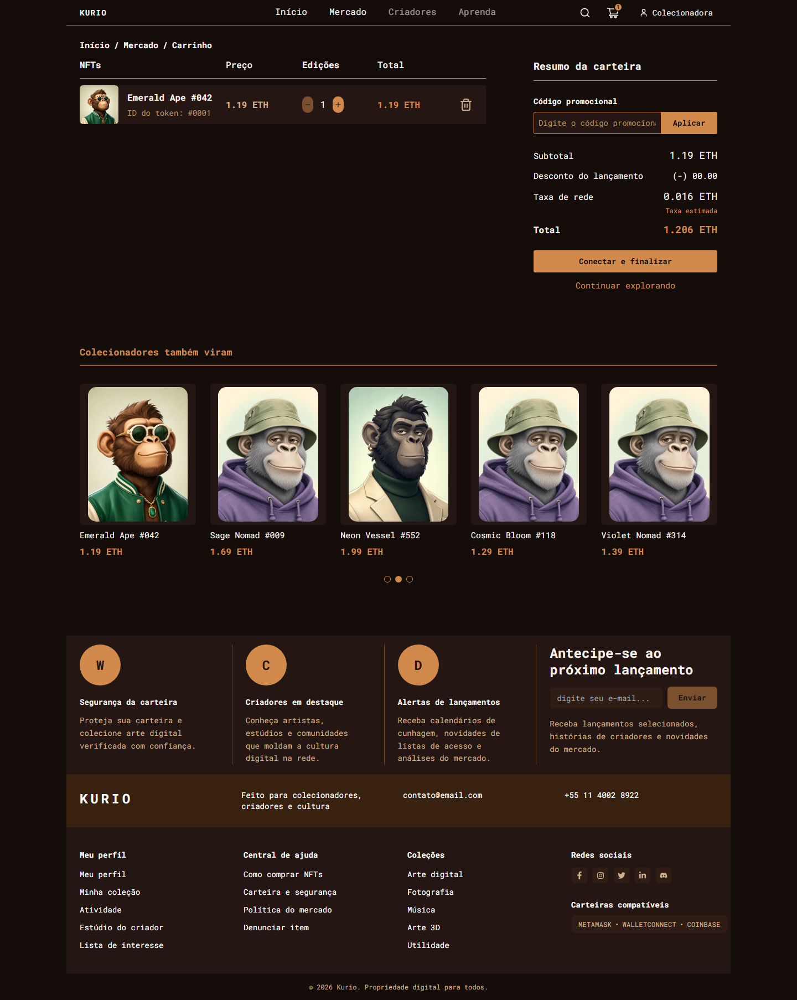
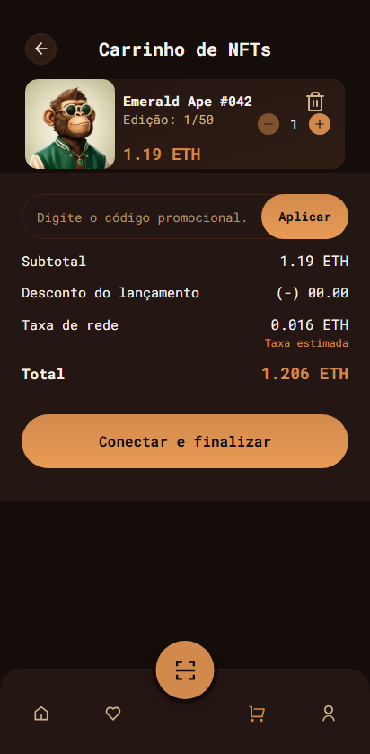
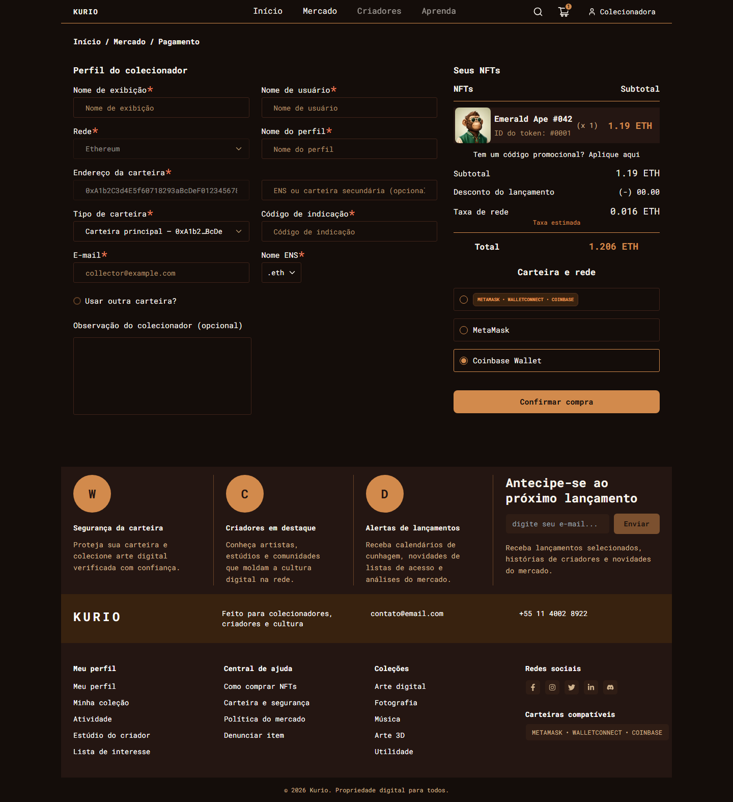
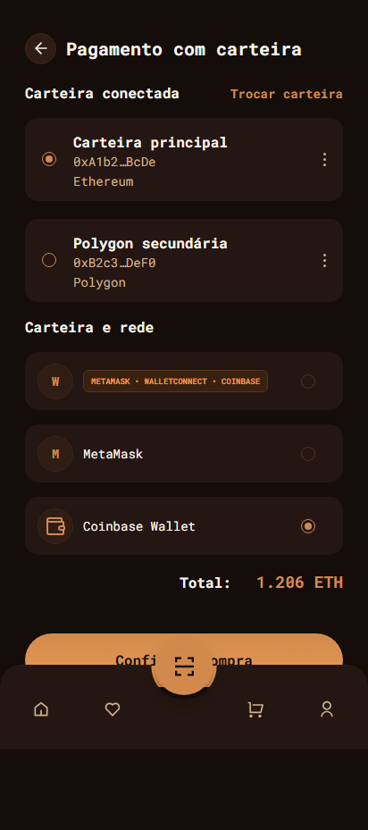

# NFT Marketplace — Frontend Challenge


---

## Screenshots do Produto (Visual Regression Baselines)

### Home
| Desktop | Mobile |
|---------|--------|
|  |  |

### Detalhe do NFT
| Desktop | Mobile |
|---------|--------|
|  |  |

### Carrinho
| Desktop | Mobile |
|---------|--------|
|  |  |

### Checkout
| Desktop | Mobile |
|---------|--------|
|  |  |

> **Baselines completas:** 8/8 screenshots (desktop + mobile) versionadas em `e2e/__screenshots__/visual.spec.ts-snapshots/`. Rodar/atualizar: `npm run test:e2e:visual -- --update-snapshots`.

---

## Documentacao

| Arquivo | Descricao |
|---------|-----------|
| [`docs/ENUNCIADO.md`](./docs/ENUNCIADO.md) | Enunciado completo do desafio |
| [`ARCHITECTURE.md`](./ARCHITECTURE.md) | Arquitetura: contratos, cache, tempo real, mocks, limitacoes |
| [`docs/DECISOES.md`](./docs/DECISOES.md) | Registro de decisoes, performance, acessibilidade, cronograma detalhado |

---

## Setup Rapido

```bash
npm install          # instala dependencias e o worker do MSW
npm run dev          # http://localhost:5173 (mocks ligados por padrao)
```

### Build de Demonstracao (para deploy)

```bash
npm run build:demo && npm run preview
```

> **Importante:** O build de demonstracao mantem MSW + Socket.IO ativos. Em producao (`npm run build`) eles ficam desligados.

---

## Credenciais Ficticias

| Usuario | E-mail | Senha |
|---------|--------|-------|
| Colecionadora | `collector@example.com` | `password123` |
| Investidor | `leo@example.com` | `senha123` |

---

## Comandos Principais

| Comando | Descricao |
|---------|-----------|
| `npm run dev` | Servidor de desenvolvimento (mocks ligados) |
| `npm run build` | Build de producao (mocks desligados) |
| `npm run build:demo` | Build de demonstracao (mocks ligados) |
| `npm run typecheck` | Gera rotas + `tsc -b` |
| `npm run lint` | ESLint |
| `npm run test:e2e` | Playwright (desktop + mobile) |
| `npm run test:e2e:visual` | Regressao visual com baselines |
| `npm run lighthouse` | Auditoria Lighthouse mobile + desktop |

---

## Telas Implementadas

| Tela | Rota | Status |
|------|------|--------|
| Inicio | `/` | Catalogo, busca, filtros, paginacao, navegacao NFT |
| Mercado | `/mercado` | Grid 3 colunas (desktop) / 2 (mobile) |
| Detalhe NFT | `/mercado/nft/:numero` | Galeria, info, edicao, quantidade, favoritos, compra |
| Carrinho | `/cart` | Quantidades, remocao, cupom, resumo |
| Checkout | `/checkout` | Dados, carteira, rede, revisao, envio |
| Confirmacao | `/orders/:orderId` | Resultado, transacao, itens, taxas, total |
| Login | `/login` | Autenticacao, validacao, redirect |
| Cadastro | `/register` | Criacao, validacao, conflito |
| Perfil | `/account/profile` | Dados, avatar, senha |
| Carteiras | `/account/wallets` | Cadastro/edicao principal + secundaria |

---

## Qualidade & Performance

| Metrica | Mobile | Desktop |
|---------|--------|---------|
| **Lighthouse Performance** | **91** (Home) / **90** (Detail) | **99** / **95** |
| **Accessibility** | 100 | 100 |
| **Best Practices** | 100 | 100 |
| **SEO** | 100 | 100 |
| **E2E Tests** | 20/20 passing | 20/20 passing |
| **Visual Regression** | 8/8 baselines | 8/8 baselines |

- `typecheck`: 0 erros
- `lint`: 0 erros (8 warnings `react-refresh` pre-existentes)

---

## Cronograma (07/10 15:18 -> 09/10)

| Fase | Periodo | Tempo | Principais Entregas |
|------|---------|-------|---------------------|
| **Setup & Arquitetura** | 07/10 15:18-19:00 | ~3.5h | TanStack Router/Query, Axios, MSW, Socket.IO, contratos tipados |
| **Mocks & Cenarios** | 07/10 19:00-22:00 | ~3h | DB, fixtures, handlers REST/WS, cenarios (`fast`, `slow-network`, etc.) |
| **Autenticacao & Guards** | 08/10 09:00-13:00 | ~4h | Login/register, JWT mock, `RequireAuth` com `?redirect=`, `mswReady` race fix |
| **Catalogo & Filtros** | 08/10 13:00-17:00 | ~4h | Grid, busca, categorias, faixa de preco (slider dual), ordenacao, paginacao |
| **Detalhe NFT** | 08/10 17:00-21:00 | ~4h | Galeria zoom, edicoes, quantidade, favoritos (optimistic), compra -> carrinho |
| **Carrinho & Cupom** | 09/10 09:00-12:00 | ~3h | Edicao qtd, remocao, cupom, snapshots preco/disponibilidade, aviso `Quote.changes` |
| **Checkout & Pedidos** | 09/10 12:00-15:00 | ~3h | Carteiras, rede, cotacao ETH (`big.js`), idempotencia, confirmacao/recusa |
| **Tempo Real (Socket.IO)** | 09/10 15:00-16:30 | ~1.5h | `nft.updated`/`order.updated`, reconciliacao REST, deduplicacao, `kurio:auth-logout` |
| **Mobile & Acessibilidade** | 09/10 16:30-18:30 | ~2h | Tab bar fixa (95px), QR alinhado, slider >=24px, skeletons shimmer, OpenDyslexic, VLibras |
| **Performance & SEO** | 09/10 18:30-19:30 | ~1h | Fontes self-hosted (subset latin), `width/height`+`lazy`, `robots.txt`/`sitemap.xml` |
| **E2E & Visual Regression** | 09/10 19:30-20:30 | ~1h | 20/20 testes (desktop+mobile), 8 baselines visuais, CI pipeline |
| **Documentacao & Deploy** | 09/10 20:30-21:30 | ~1h | README, ARCHITECTURE, DECISOES, screenshots mobile, Vercel PRs |

| **Total** | **07/10 15:18 -> 09/10 14:34** | **~31h** | **Entrega completa** |

> **Nota:** Prazo original de 2 dias uteis (07/10-09/10). Trabalho executado em ~31h distribuidas ao longo de 2 dias, com margem para imprevistos (fixes de CI, ajustes de mobile tab bar, crash `includes`).

---

## Stack Obrigatoria

| Responsabilidade | Tecnologia |
|------------------|------------|
| Interface | React 19 |
| Linguagem | TypeScript |
| Roteamento | TanStack Router (file-based + Zod) |
| Estado remoto | TanStack Query v5 |
| Cliente HTTP | Axios |
| Integracao de dados | REST APIs |
| Tempo real | Socket.IO + MSW (`@mswjs/socket.io-binding`) |
| Estilizacao | Tailwind CSS v3 |
| Componentes | shadcn/ui (Radix) |
| Formularios | react-hook-form + Zod |
| Mocking | MSW (REST + WebSocket) |
| Testes E2E / Visual | Playwright |
| Performance | Lighthouse CI |

---

## Branches & Workflow Git

```text
main      -> producao (nunca push direto)
homolog   -> validacao/release de PRs (staging)
develop   -> integracao diaria (merges das feat/*)
feature   -> feat/<assunto> + PR para develop
```

- **Commits:** `feat:`, `fix:`, `test:`, `docs:`, `design:`, `ops:`, `backend:` (Conventional Commits)
- **PRs:** via template; merge via PR de `homolog` -> `main` (branch protegida)
- **Checks obrigatorios:** `typecheck`, `lint`, `test:e2e`

---

## Links Uteis

- **Producao (Vercel):** https://frontend-challenge-indol-zeta.vercel.app
- **Preview (homolog):** https://frontend-challenge-git-homolog-ezequiel-reginos-projects.vercel.app
- **E2E Artifacts (GitHub Actions):** [Run #37962466359](https://github.com/zecki1/frontend-challenge/actions/runs/37962466359) - screenshots/videos em **Artifacts** -> `test-results/`
- **Figma:** [Layout Oficial](https://www.figma.com/design/Ff0SksUi7UFtPWUO8kyNtw/Frontend-Challenge?node-id=0-1)

---

## Licenca

Projeto de desafio tecnico - uso educacional/avaliacao.