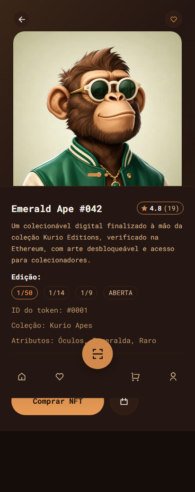

# NFT Marketplace — Frontend Challenge


---

## 📸 Screenshots do Produto (Mobile)

### Detalhe do NFT — Mobile


### Checkout — Mobile
 | Enunciado completo do desafio |
| [`ARCHITECTURE.md`](./ARCHITECTURE.md) | Arquitetura: contratos, cache, tempo real, mocks, limitações |
| [`docs/DECISOES.md`](./docs/DECISOES.md) | Registro de decisões, performance, acessibilidade, cronograma |
| [`docs/RESUMO-ENTREGA.md`](./docs/RESUMO-ENTREGA.md) | Checklist de entrega e validações |

---

## 🚀 Setup Rápido

```bash
npm install          # instala dependências e o worker do MSW
npm run dev          # http://localhost:5173 (mocks ligados por padrão)
```

### Build de Demonstração (para deploy)

```bash
npm run build:demo && npm run preview
```

> **Importante:** O build de demonstração mantém MSW + Socket.IO ativos. Em produção (`npm run build`) eles ficam desligados.

---

## 🔐 Credenciais Fictícias

| Usuário | E-mail | Senha |
|---------|--------|-------|
| Colecionadora | `collector@example.com` | `password123` |
| Investidor | `leo@example.com` | `senha123` |

---

## ⚡ Comandos Principais

| Comando | Descrição |
|---------|-----------|
| `npm run dev` | Servidor de desenvolvimento (mocks ligados) |
| `npm run build` | Build de produção (mocks desligados) |
| `npm run build:demo` | Build de demonstração (mocks ligados) |
| `npm run typecheck` | Gera rotas + `tsc -b` |
| `npm run lint` | ESLint |
| `npm run test:e2e` | Playwright (desktop + mobile) |
| `npm run test:e2e:visual` | Regressão visual com baselines |
| `npm run lighthouse` | Auditoria Lighthouse mobile + desktop |

---

## 📱 Telas Implementadas

| Tela | Rota | Status |
|------|------|--------|
| Início | `/` | ✅ Catálogo, busca, filtros, paginação, navegação NFT |
| Mercado | `/mercado` | ✅ Grid 3 colunas (desktop) / 2 (mobile) |
| Detalhe NFT | `/mercado/nft/:numero` | ✅ Galeria, info, edição, quantidade, favoritos, compra |
| Carrinho | `/cart` | ✅ Quantidades, remoção, cupom, resumo |
| Checkout | `/checkout` | ✅ Dados, carteira, rede, revisão, envio |
| Confirmação | `/orders/:orderId` | ✅ Resultado, transação, itens, taxas, total |
| Login | `/login` | ✅ Autenticação, validação, redirect |
| Cadastro | `/register` | ✅ Criação, validação, conflito |
| Perfil | `/account/profile` | ✅ Dados, avatar, senha |
| Carteiras | `/account/wallets` | ✅ Cadastro/edição principal + secundária |

---

## ✅ Qualidade & Performance

| Métrica | Mobile | Desktop |
|---------|--------|---------|
| **Lighthouse Performance** | **91** (Home) / **90** (Detail) | **99** / **95** |
| **Accessibility** | 100 | 100 |
| **Best Practices** | 100 | 100 |
| **SEO** | 100 | 100 |
| **E2E Tests** | 20/20 passing | 20/20 passing |
| **Visual Regression** | 8/8 baselines | 8/8 baselines |

- `typecheck`: 0 erros
- `lint`: 0 erros (8 warnings `react-refresh` pré-existentes)

---

## 🕐 Cronograma

| Evento | Data/Hora |
|--------|-----------|
| **Teste recebido** | **07/10/2026 (quarta-feira) às 15:18** |
| Início implementação | 07/10/2026 |
| Entrega final (merge main) | **09/10/2026** |
| **Tempo total** | **~2 dias úteis** |

---

## 🏗️ Stack Obrigatória

| Responsabilidade | Tecnologia |
|------------------|------------|
| Interface | React 19 |
| Linguagem | TypeScript |
| Roteamento | TanStack Router (file-based + Zod) |
| Estado remoto | TanStack Query v5 |
| Cliente HTTP | Axios |
| Integração de dados | REST APIs |
| Tempo real | Socket.IO + MSW (`@mswjs/socket.io-binding`) |
| Estilização | Tailwind CSS v3 |
| Componentes | shadcn/ui (Radix) |
| Formulários | react-hook-form + Zod |
| Mocking | MSW (REST + WebSocket) |
| Testes E2E / Visual | Playwright |
| Performance | Lighthouse CI |

---

## 🌿 Branches & Workflow Git

```text
main      → produção (nunca push direto)
homolog   → validação/release de PRs (staging)
develop   → integração diária (merges das feat/*)
feature   → feat/<assunto> + PR para develop
```

- **Commits:** `feat:`, `fix:`, `test:`, `docs:`, `design:`, `ops:`, `backend:` (Conventional Commits)
- **PRs:** via template; merge via PR de `homolog` → `main` (branch protegida)
- **Checks obrigatórios:** `typecheck`, `lint`, `test:e2e`

---

## 🔗 Links Úteis

- **Produção (Vercel):** https://frontend-challenge-indol-zeta.vercel.app
- **Preview (homolog):** https://frontend-challenge-git-homolog-ezequiel-reginos-projects.vercel.app
- **E2E Artifacts (GitHub Actions):** [Run #37962466359](https://github.com/zecki1/frontend-challenge/actions/runs/37962466359) — screenshots/vídeos em **Artifacts** → `test-results/`
- **Figma:** [Layout Oficial](https://www.figma.com/design/Ff0SksUi7UFtPWUO8kyNtw/Frontend-Challenge?node-id=0-1)

---

## ⚠️ Pendências Conhecidas (Backlog)

- §7 Aviso de preço alterado no carrinho (UI + i18n)
- 35 chaves i18n não usadas
- 8 warnings `react-refresh/only-export-components`
- §9 Baselines `toHaveScreenshot` (config já existe)
- Variantes 320/480 das artes (Lighthouse `uses-responsive-images`)
- Performance mobile ≥ 90 (gargalo: chunk `router-*.js` ~276 KB)

---

## 📄 Licença

Projeto de desafio técnico — uso educacional/avaliação.